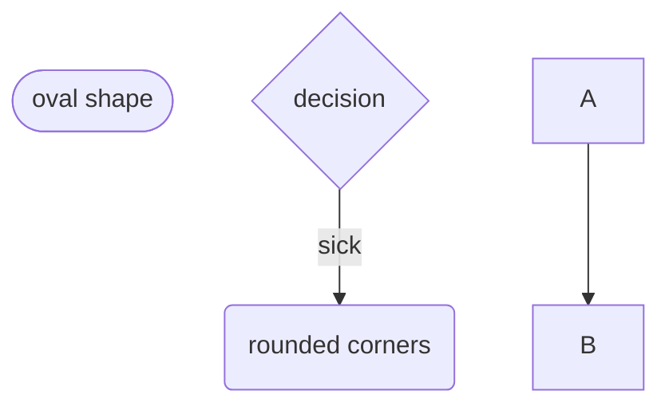

# Programming Logic

> For each behaviour, create the mermaid flowchart. Start each flowchart with a Heading naming the functionality. Delete this comment prior to submission.

## title here bugrhu




## Sonar 


```mermaid 
flowchart TD
    sonarInput(Sonar Input)

    sonarInput-->sonarDecision

    sonarDecision{Does the sonar <br/> detect something?}

    sonarDecision-->|yes| slowDown

    slowDown(Slow down DC motor)
    slowDown-->complete

    sonarDecision-->|no|complete


    complete(end)
 ```