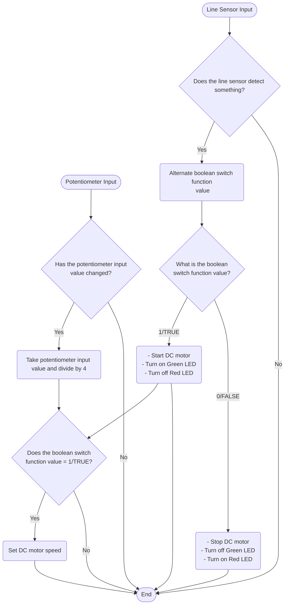
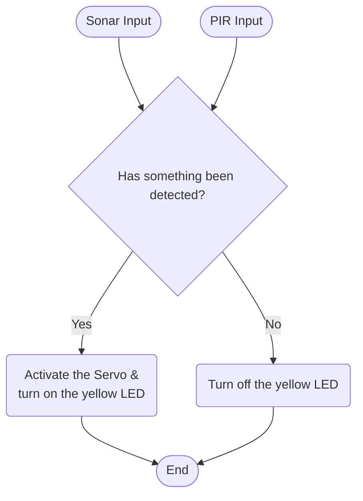

# Programming Logic
## Engine Control <br>- Ignition (Line Sensor, Red & Green LED) <br>- Accelerator (Potentiometer)

## Ejector Seat (Sonar, PIR, Servo & Yellow LED)

## Self Destruct (Crash sensor & Piezo)
 ```mermaid
 flowchart TD
    crashSensorInput([Crash Sensor Input])

    crashSensorInput-->crashSensorDecision

    crashSensorDecision{Has the Crash Sensor<br/>Been Pressed?}

    crashSensorDecision-->|Yes|crashSensor

    crashSensor(Make Piezo beep twice)
    crashSensor-->complete

    crashSensorDecision-->|No|complete

    complete([End])
```