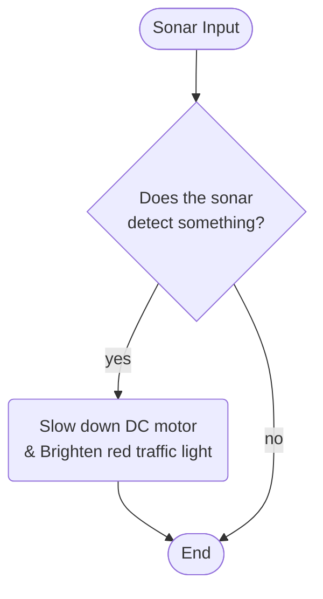

# Programming Logic

> For each behaviour, create the mermaid flowchart. Start each flowchart with a Heading naming the functionality. Delete this comment prior to submission.

## title here bugrhu


## Sonar 

## Line Sensor 
 ```mermaid
 flowchart TD
    lineSensorInput([Line Sensor Input])

    lineSensorInput-->lineSensorDecision

    lineSensorDecision{Does the Line Sensor <br/>Detect Something?}

    lineSensorDecision-->|yes|DCMotor

    DCMotor(Start/Stop DC motor)
    DCMotor-->complete

    lineSensorDecision-->|no|complete

    complete([End])
```
## Crash Sensor
 ```mermaid
 flowchart TD
    crashSensorInput([Crash Sensor Input])

    crashSensorInput-->crashSensorDecision

    crashSensorDecision{Has the Crash Sensor<br/>Been Pressed?}

    crashSensorDecision-->|yes|crashSensor

    crashSensor(Activate Piezo)
    crashSensor-->complete

    crashSensorDecision-->|no|complete

    complete([End])
```