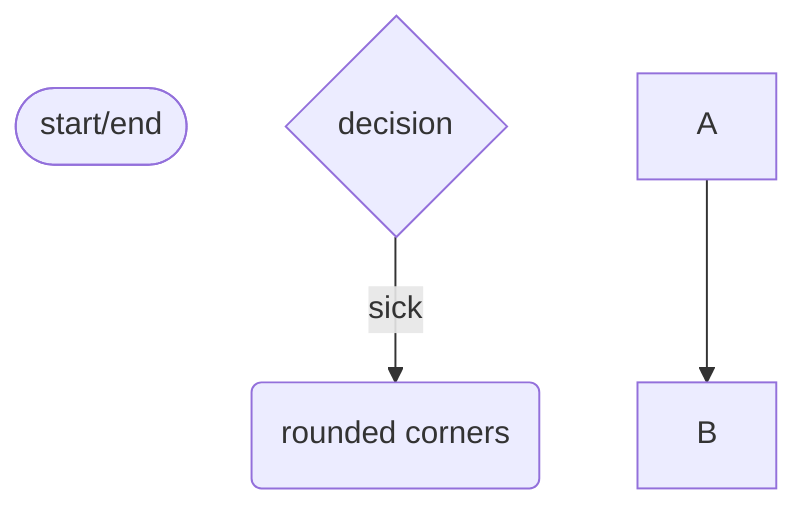
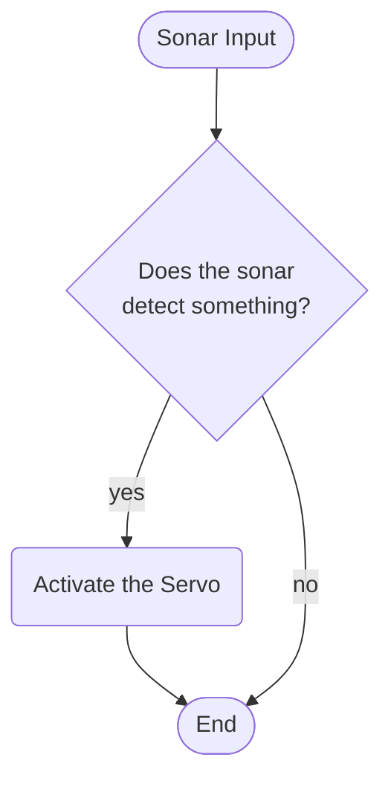

# Programming Logic

> For each behaviour, create the mermaid flowchart. Start each flowchart with a Heading naming the functionality. Delete this comment prior to submission.

## title here bugrhu




## Sonar (Ejector Seat)

## Line Sensor (Start/Stop Engine)
 ```mermaid
 flowchart TD
    lineSensorInput([Line Sensor Input])

    lineSensorInput-->lineSensorDecision

    lineSensorDecision{Does the Line Sensor <br/>Detect Something?}

    lineSensorDecision-->|yes|DCMotor

    DCMotor(Start/Stop DC motor)
    DCMotor-->complete

    lineSensorDecision-->|no|complete

    complete([End])
```
## Crash Sensor (Self Destruct)
 ```mermaid
 flowchart TD
    crashSensorInput([Crash Sensor Input])

    crashSensorInput-->crashSensorDecision

    crashSensorDecision{Has the Crash Sensor<br/>Been Pressed?}

    crashSensorDecision-->|yes|crashSensor

    crashSensor(Activate Piezo)
    crashSensor-->complete

    crashSensorDecision-->|no|complete

    complete([End])
```
## Potentiometer (Engine Speed)
 ```mermaid
 flowchart TD
    potInput([Potentiometer Input])

    potInput-->potDecision

    potDecision{Has the Value of the <br>Potentiometer changed?}

    potDecision-->|yes|potentiometer

    potentiometer(Alter speed of DC Motor)
    potentiometer-->complete

    potDecision-->|no|complete

    complete([End])
```
## GPS?? (Traffic Lights and stuff)
 ```mermaid
 flowchart TD
    GPS([Crash Sensor Input])

    GPS-->GPSLogic

    GPSLogic{Is the yet to be decided GPS Logic <br>doing getting the output required to do something?}

    GPSLogic-->|yes|GPSOutput

    GPSOutput(Do stuff, probably <br>traffic light related stuff)
    GPSOutput-->complete

    GPSLogic-->|no|complete 

    complete([End])
```