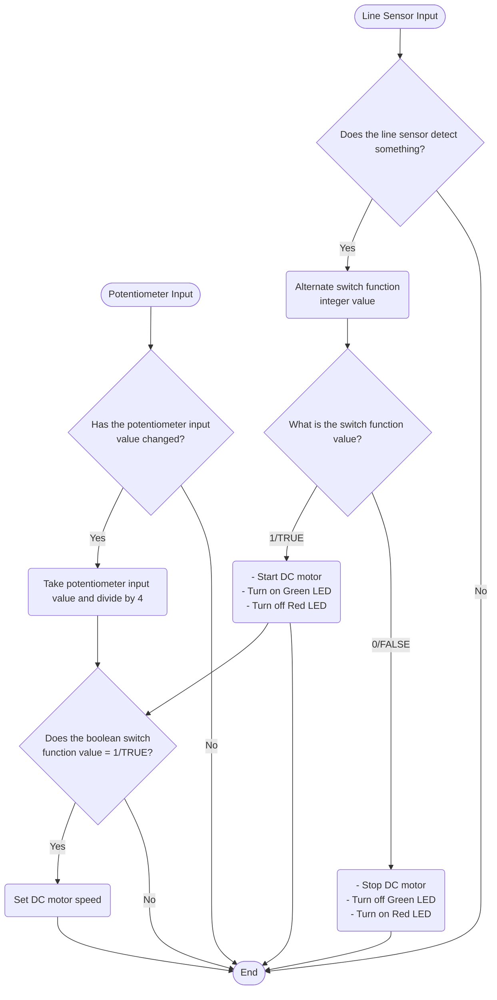

# Programming Logic
## Engine Control (DC Motor)<br>- Ignition (Line Sensor, Red & Green LED) <br>- Accelerator (Potentiometer)

## Ejector Seat (Servo & Yellow LED)<br>- Detection System (Sonar & PIR)
 ```mermaid
 flowchart TD
    sonarInput([Sonar Input])
    PIRInput([PIR Input])

    sonarInput-->sonarDecision
    sonarDecision{Has something been detected<br>in less than 20cm?}
    -->|1/TRUE|Decision
    sonarDecision-->|0/FALSE|complete

    PIRInput-->PIRDecision
    PIRDecision{Does the PIR detect movement?}
    -->|1/TRUE|Decision
    PIRDecision-->|0/FALSE|complete

    Decision{Does the Sonar<br>OR<br>PIR output 1/TRUE?}

    Decision-->|Yes|on

    on(Activate the Servo & <br> turn on the yellow LED)
    on-->complete

    Decision-->|No|off
    off(Deactivate the Servo & <br> turn off the yellow LED)
    off-->complete


    complete([End])
```
## Self Destruct (Crash sensor & Piezo)
 ```mermaid
 flowchart TD
    crashSensorInput([Crash Sensor Input])

    crashSensorInput-->crashSensorDecision

    crashSensorDecision{Has the Crash Sensor<br/>Been Pressed?}

    crashSensorDecision-->|Yes|crashSensor

    crashSensor(Make Piezo beep twice)
    crashSensor-->complete

    crashSensorDecision-->|No|complete

    complete([End])
```